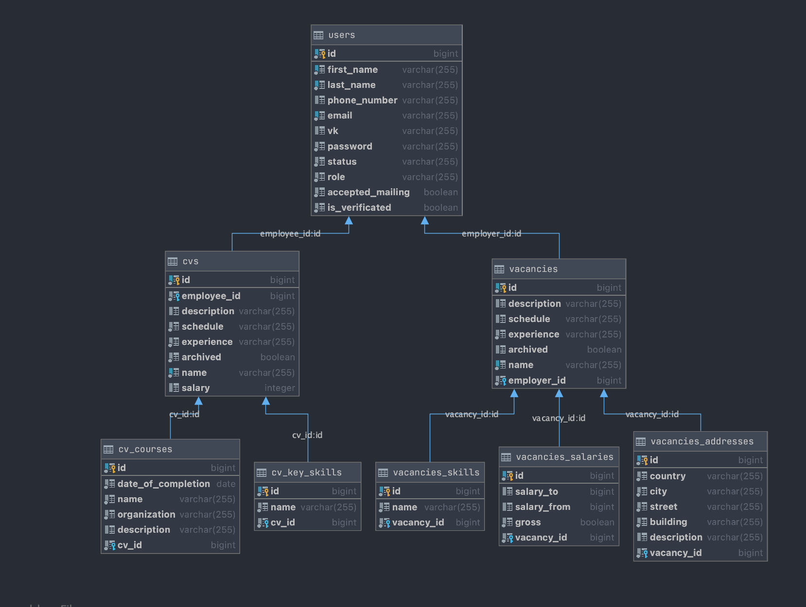

# Labhunter : документация

### Оглавление:

- [О проекте](#о-проекте)
- [Сборка и запуск](#сборка-и-запуск)
- [Список запросов](#список-запросов)
  - [Система авторизации/регистрации](#система-авторизации)
  - [Система администратора](#система-администратора)
  - [Система соискателя](#система-соискателя)
  - [Система работодателя](#система-работодателя)
- [Схема базы данных](#схема-базы)

------

### О проекте: <a name="о-проекте"/>

Проект Labhunter нацелен на упрощение взаимодействия между лабораториями и студентами. Студенты могут создавать свои резюме, которые будут выводиться по соответствующему запросу работодателя по каждой его вакансии, опираясь на ключевые навыки. Аналогично, студенты могут искать стажировки в лаборатории: по каждому резюме, по ключевым навыкам, будут подбираться подходящие вакансии. Кроме UI, планируется интеграция с telegram ботом и почтой для рассылки уведомлений о новых резюме/вакансиях. На данный момент, проект находится в активной разработке.

Технологии, задействованные в проекте:

- Java 11
- Spring MVC
- Spring Data JPA
- Spring Security
- Spring Cloud
- Maven
- Liquibase
- Docker
- k8s  
- PostgreSQL
- JUnit 5
- Mockito

[Ссылка на swagger](https://app.swaggerhub.com/apis/lab-hunter/labhunter/0.1.0)

------

### Сборка и запуск: <a name="сборка-и-запуск"/>

- Запустить `docker-compose up` в корневой папке проекта и запустить локально приложение.

------

### Список запросов: <a name="список-запросов"/>

##### Система авторизации/регистрации: <a name="система-авторизации"/>

- Запрос для авторизации в системе:

    `curl --location --request POST 'localhost:8080/api/auth/login --header 'Content-Type: application/json' --data-raw '{"email: "YOUR_EMAIL", "password": "YOUR_PASSWORD"}`
  
    Базовый админский аккаунт, создаваемый liquibase при разворачивании БД:
  
    ​	email: fomin.as@phystech.edu
  
    ​	password: kniffenfork
  
    В качестве ответа, выдается JSON формата `{"email": "YOUR EMAIL", "token": "authorization_token"}`. Токен, впоследствии, следует помещать в header запросов, требующих авторизацию пользователя. Для входа, статус пользователя должен быть ACTIVE.
  
    Роли пользователей: ADMIN, EMPLOYEE, EMPLOYER.
  
- Запрос для выхода из системы:
  
    `curl --location --request POST 'localhost:8080/api/auth/logout --header 'Content-Type: application/json'`
  
- Запрос для регистрации нового соискателя:
  
    `curl --location --request POST 'localhost:8080/api/auth/registration/employee' --header 'Content-Type: 			application/json' --data-raw '{"email": {EMAIL}, "firstName": {FIRST_NAME}, "lastName": {LAST_NAME}, "password": {PASSWORD}, "confirmPassword": {PASSWORD}}'`

Здесь и далее, при регистрации пользователя, все поля должны быть непустыми.

- Запрос для регистрации нового работодателя:
  
    `curl --location --request POST 'localhost:8080/api/auth/registration/employer' --header 'Content-Type: application/json' --data-raw '{"email": {EMAIL}, "firstName": {FIRST_NAME}, "lastName": {LAST_NAME}, "password": {PASSWORD}, "confirmPassword": {PASSWORD}}'`
  
- Запрос для регистрации нового админа: 
  
  `curl --location --request POST 'localhost:8080/api/auth/registration/admin' --header 'Content-Type: application/json' --header 'Authorization: AUTHORIZATION_TOKEN' --data-raw '{"email": {EMAIL}, "firstName": {FIRST_NAME}, "lastName": {LAST_NAME}, "password": {PASSWORD}, "confirmPassword": {PASSWORD}}'`
  
  Запрос может осуществляться только другим авторизовавшемся админом.

------

##### Система администратора: <a name="система-администратора"/>

- Запрос для получения всех зарегистрированных пользователей:
  
    `curl --location --request GET 'localhost:8080/api/admin/user' --header 'Content-Type:application/json' --header 'Authorization: AUTHORIZATION_TOKEN' `
  
    В качестве ответа, выдается JSON с информацией обо всех зарегестрированных пользователях.

  У данного запроса есть вариации с параметрами:

  - `curl --location --request GET 'localhost:8080/api/admin/user?id={id}' --header 'Content-Type:application/json' --header 'Authorization: AUTHORIZATION_TOKEN' `

    В качестве ответа, выведется JSON с информацией о пользователе с определенным id.

  - `curl --location --request GET 'localhost:8080/api/admin/user?email={user_email}' --header 'Content-Type:application/json' --header 'Authorization: AUTHORIZATION_TOKEN' `

    В качестве ответа, выведется JSON с информацией о пользователе с определенным email.

- Запрос для получения всех пользователей:

  -  с ролью ADMIN:
     
        `curl --location --request GET 'localhost:8080/api/admin/admin' --header 'Content-Type:application/json' --header 'Authorization: AUTHORIZATION_TOKEN' `
  - с ролью EMPLOYER:
    
    `curl --location --request GET 'localhost:8080/api/admin/employer' --header 'Content-Type:application/json' --header 'Authorization: AUTHORIZATION_TOKEN' `
  - с ролью EMPLOYEE:
    
    `curl --location --request GET 'localhost:8080/api/admin/employee' --header 'Content-Type:application/json' --header 'Authorization: AUTHORIZATION_TOKEN' `

- Запрос для блокировки пользователя:

  - по id:
    
    `curl --location --request PUT 'localhost:8080/api/admin/ban/id' --header 'Content-Type:application/json' --header 'Authorization: AUTHORIZATION_TOKEN' --data-raw '{id: {ID}}'`
    
  - по email:

    `curl --location --request PUT 'localhost:8080/api/admin/ban/email' --header 'Content-Type:application/json' --header 'Authorization: AUTHORIZATION_TOKEN' --data-raw '{email: {EMAIL}}'`

- Запрос для разблокировки пользователя:

  - по id:
    
    `curl --location --request PUT 'localhost:8080/api/admin/unban/id' --header 'Content-Type:application/json' --header 'Authorization: AUTHORIZATION_TOKEN' --data-raw '{id: {ID}}'`
  - по email:
    
    `curl --location --request PUT 'localhost:8080/api/admin/unban/email' --header 'Content-Type:application/json' --header 'Authorization: AUTHORIZATION_TOKEN' --data-raw '{email: {EMAIL}}'`

- Запрос для верифицирования пользователя:

  - по id:
    
    `curl --location --request PUT 'localhost:8080/api/admin/verificate/id' --header 'Content-Type:application/json' --header 'Authorization: AUTHORIZATION_TOKEN' --data-raw '{id: {ID}}'`
  - по email:
    
    `curl --location --request PUT 'localhost:8080/api/admin/verificate/email' --header 'Content-Type:application/json' --header 'Authorization: AUTHORIZATION_TOKEN' --data-raw '{email: {EMAIL}}'`

- Запрос для разверифицирования пользователя:

  - по id:
    
    `curl --location --request PUT 'localhost:8080/api/admin/unverificate/id' --header 'Content-Type:application/json' --header 'Authorization: AUTHORIZATION_TOKEN' --data-raw '{id: {ID}}'`
  - по email:
    
    `curl --location --request PUT 'localhost:8080/api/admin/unverificate/email' --header 'Content-Type:application/json' --header 'Authorization: AUTHORIZATION_TOKEN' --data-raw '{email: {EMAIL}}'`

------

##### Система соискателя: <a name="система-соискателя"/>

- Запрос для создания нового резюме:
  
    `curl --location --request POST 'localhost:8080/api/employee/cv' --header 'Content-Type: application/json' --header 'Authorization: AUTHORIZATION_TOKEN' --data-raw '{"description": {CV DESCTIPTION}, "schedule": {SCHEDULE}, "experience": {EXPERIENCE}, "salary": {REQUESTED SALARY ON HAND}, "name": {REQUESTED JOB}}'`
  
    Все поля, кроме `salary` должны быть непустыми.
  
- Запрос для вывода списка резюме всех резюме у авторизовавшегося пользователя:
  
    `curl --location --request GET 'localhost:8080/api/employee/cv' --header 'Content-Type:application/json' --header 'Authorization: AUTHORIZATION_TOKEN' `

Параметры запроса:

  - вывод резюме у пользователя с определенным id:
    
    `curl --location --request GET 'localhost:8080/api/employee/cv?id={ID}' --header 'Content-Type:application/json' --header 'Authorization: AUTHORIZATION_TOKEN' `
  - Запрос для удаления резюме у пользователя с определенным id:
    
    `curl --location --request DELETE 'localhost:8080/api/employee/cv' --header 'Content-Type:application/json' --header 'Authorization: AUTHORIZATION_TOKEN' --data-raw '{id: {ID}}'`

------

##### Система работодателя: <a name="система-работодателя"/>

- 

------

### Схема базы данных: <a name="схема-базы"/>

